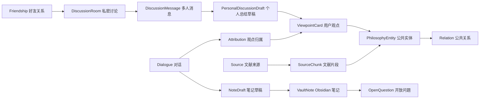
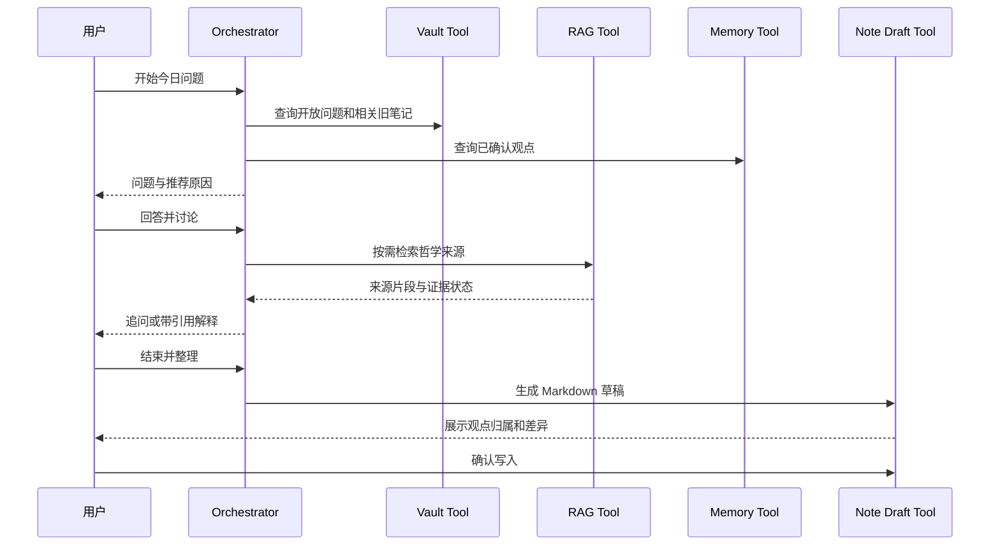

# PhilosophyOS 知识与记忆模型

## 1. 设计目标

- 同时支持哲学史时间线、问题比较、RAG 引用和个人思想档案。
- 明确区分公共哲学知识与用户私人观点。
- 西方哲学先行，但允许后期增加中国哲学的独立分类体系。
- MVP 可用关系数据库和向量索引实现，不依赖 Neo4j。

## 2. 领域分层

## 3. 公共知识实体

### 3.1 PhilosophyEntity

| 字段 | 类型 | 说明 |
| --- | --- | --- |
| id | UUID | 稳定标识 |
| tradition | enum | `western`；后期增加 `chinese` |
| entity_type | enum | philosopher/concept/work/school/question/period |
| canonical_name | string | 标准中文名 |
| original_name | string? | 原文名称 |
| aliases | string[] | 常用译名、别名 |
| summary | text | 中性简介 |
| period_id | UUID? | 所属时代 |
| depth_level | enum | L1/L2/L3 |
| review_status | enum | draft/reviewed/published/retired |

`tradition` 只负责内容域隔离，不意味着中西哲学共享同一分期和概念层级。

### 3.2 Relation

| 字段 | 类型 | 说明 |
| --- | --- | --- |
| source_entity_id | UUID | 起点 |
| relation_type | enum | 关系词表 |
| target_entity_id | UUID | 终点 |
| direction | enum | directed/undirected |
| claim | text | 关系的具体说明 |
| confidence | enum | high/medium/low/disputed |
| evidence_ids | UUID[] | 支撑来源 |
| review_status | enum | 审核状态 |

首批关系词：

- `authored`：创作。
- `proposed`：提出或系统发展。
- `influenced`：影响。
- `criticized`：批判。
- `developed`：继承并发展。
- `belongs_to`：属于流派或时代。
- `addresses`：回应哲学问题。
- `uses_concept`：使用核心概念。
- `contrasts_with`：形成重要对照。
- `translated_as`：术语或译名对应。

`influenced` 和 `criticized` 必须有来源，不允许仅因时间先后自动生成。

### 3.3 Source 与 SourceChunk

Source 保存作者、标题、版本、译者、语言、版权状态、来源等级和可引用范围。SourceChunk 保存章节、位置、片段、向量和内容哈希。

直接引语必须引用 `SourceChunk`，而且对应 Source 的等级为 S1、版权状态允许展示。

## 4. 用户思想数据

### 4.1 Attribution

用于解决“谁说的”问题。

| 字段 | 类型 | 说明 |
| --- | --- | --- |
| subject_type | enum | user/third_party/author/assistant/unknown |
| subject_label | string? | 如“女朋友”“康德” |
| proposition | text | 观点内容 |
| evidence_message_id | UUID | 原始对话消息 |
| confidence | number | 识别置信度 |
| user_confirmed | boolean | 是否经用户确认 |

`unknown` 或未确认的第三方转述不能写入用户长期立场。

### 4.2 ViewpointCard

| 字段 | 类型 | 说明 |
| --- | --- | --- |
| topic_entity_ids | UUID[] | 关联问题和概念 |
| proposition | text | 用户观点的中性摘要 |
| reasons | text[] | 用户给出的理由 |
| open_questions | text[] | 尚未解决的问题 |
| stance_status | enum | tentative/confirmed/revised/withdrawn |
| source_dialogue_id | UUID | 来源对话 |
| confirmed_at | datetime? | 用户确认时间 |

不保存“用户是存在主义者”这类固定标签；只保存带时间和来源的具体观点。

### 4.3 OpenQuestion

来源可以是每日挑战、对话或 Obsidian 章节。状态为 open/in_progress/revisit/resolved/archived，并保存下次复访时间。

## 5. Obsidian 模型

### 5.1 VaultNote

| 字段 | 说明 |
| --- | --- |
| relative_path | 相对仓库路径，不保存无必要的绝对路径 |
| title/type/status/tags | YAML 属性 |
| headings | 标题及行号 |
| wikilinks | 双向链接目标 |
| tasks | 未完成任务 |
| content_hash | 写入冲突检测 |
| indexed_at | 最近索引时间 |

### 5.2 NoteDraft

保存目标文件、操作类型 create/update、草稿、结构化差异、关联来源和确认状态。写入前重新计算 `content_hash`；文件已变化时停止写入并要求重新生成差异。

## 6. 推荐数据流

## 7. 好友与讨论数据

### 7.1 Friendship 与 FriendRequest

FriendRequest 保存发起者、接收者、来源、状态和过期时间。Friendship 只在请求被接受后创建，使用无方向的用户对关系；拉黑关系单独保存并在所有好友和房间接口前校验。

### 7.2 DiscussionRoom

| 字段 | 说明 |
| --- | --- |
| id | 不可猜测的房间标识 |
| title/question | 讨论标题和核心问题 |
| created_by | 创建者 |
| visibility | MVP 固定为 private |
| ai_moderator_enabled | 是否启用 AI 主持 |
| retention_policy | 7 天/30 天/永久 |
| invite_policy | 仅创建者/所有成员 |
| status | active/closed/archived |

成员关系保存 joined/left/removed 状态和对应时间。服务端每次读取消息、来源和总结前检查当前成员权限。

### 7.3 DiscussionMessage 与共享内容

每条消息必须绑定明确作者。分享对象使用快照和来源引用保存，避免原始观点卡片修改后静默改变房间历史。快照只包含用户主动选择的内容，不包含整篇 Obsidian 笔记或思想档案。

### 7.4 多人总结

共同总结保存各参与者观点、共同点、分歧和开放问题，但不能直接进入个人长期记忆。系统为每位参与者生成独立 PersonalDiscussionDraft，只提取该用户自己的观点；用户确认后才能转为 ViewpointCard 或 NoteDraft。

### 7.5 社交安全

- Block：阻止请求、邀请和新消息。
- Report：保存目标、类别、说明、证据消息和处理状态。
- RateLimit：限制好友请求、邀请和消息频率。
- Audit：记录成员变更和权限决策，不记录无必要的完整私密正文。

## 8. MVP 存储建议

- PostgreSQL：公共实体、关系、用户、对话、观点和审计记录。
- pgvector 或独立向量数据库：文献片段和授权笔记片段。
- 本地文件索引：Obsidian 路径、哈希和链接。
- 对象存储：仅保存用户明确上传且允许保存的文档。
- Neo4j：Phase 3 图谱查询复杂度证明有必要后再引入。

## 9. 中国哲学扩展约束

后期增加 `tradition=chinese` 时：

- 新建中国哲学自己的 Period 数据，不复用西方时期枚举。
- 经典可具有经、传、注、疏等版本关系。
- 人物与学派关系允许师承、注疏、判教等独立关系类型。
- 跨传统映射使用 `compared_with` 并附比较维度，不使用 `same_as`。

## 10. 商业化账号与工作区隔离

这一节定义 PhilosophyOS 从本地 Beta 进入商业化多用户产品前必须具备的最小数据边界。当前本地版本可以被视为“一个隐式用户 + 一个隐式本地工作区”；商业化版本不能再依赖这个假设。

### 10.1 身份层级

| 对象 | 作用 | 必须边界 |
| --- | --- | --- |
| User | 登录身份、账单主体、客服联系人 | 全局唯一 `user_id` |
| Workspace | 一套独立的思想档案、模型配置和 Obsidian 边界 | `workspace_id`、`owner_user_id` |
| Membership | 用户在工作区内的访问关系 | `user_id`、`workspace_id`、`role` |
| Device | 可选的本地客户端身份，用于同步和恢复 | `device_id`、`user_id` |

即使商业化第一版 UI 只暴露一个默认工作区，后端数据模型也必须预留 `workspace_id`，避免后续团队版、云同步和计费改造时发生大规模迁移。

### 10.2 核心对象归属规则

| 数据对象 | 归属边界 |
| --- | --- |
| DialogueSession | 直接保存 `workspace_id`、`created_by_user_id`；消息继承会话边界 |
| ReflectionSnapshotRecord | 保存 `workspace_id`、`created_by_user_id`、来源对话 |
| ViewpointCard / 思想卡片 | 保存 `workspace_id`、`subject_user_id`、证据来源 |
| OpenQuestion | 保存 `workspace_id`；提醒类能力可追加 `assigned_user_id` |
| ModelProfileConfig | 保存 `workspace_id`；API Key 是工作区密钥，不是全局密钥 |
| VaultNote 索引 | 保存 `workspace_id`；不得暴露其他工作区的路径 |
| NoteDraft / 写入审计 | 保存 `workspace_id`、`created_by_user_id`、目标路径哈希和动作 |
| ExportPackage | 保存 `workspace_id`、`requested_by_user_id`、生成时间和对象范围 |

公共哲学家、公共概念、公共来源、种子问题不属于某个用户工作区。用户对公共对象的收藏、关联、筛选和证据链，属于用户工作区。

### 10.3 访问控制规则

所有读写路径必须遵循同一顺序：

1. 解析当前用户。
2. 解析当前工作区。
3. 校验用户是否是该工作区成员。
4. 所有查询强制按 `workspace_id` 过滤。
5. 删除、导出、模型配置、Obsidian 写入等高风险动作再做对象级权限检查。

最小角色：

| 角色 | 能力 |
| --- | --- |
| owner | 管理账单、删除工作区、全量导出、轮换工作区密钥 |
| admin | 管理成员、导出工作区数据、配置模型 |
| editor | 创建对话、快照、报告、Obsidian 草稿和写入 |
| viewer | 查看档案、图谱、报告，不可写入 |

浏览器传入的 `workspace_id` 只能作为选择意图，不能作为权限事实。后端必须从认证用户的 membership 推导有效工作区。

### 10.4 模型配置与密钥边界

- GPT、DeepSeek、豆包等模型 Key 默认属于工作区。
- 用户自带 Key 只用于该工作区的模型调用。
- 托管套餐若使用平台 Key，必须进入服务端密钥管理系统，不进入用户导出包。
- GET 接口只允许返回 `configured`、模型名、安全 Base URL、API 风格和必要的掩码。
- 日志不得记录完整 API Key、加密 envelope、Authorization header 或供应商响应头。

### 10.5 导出范围

工作区导出应包含：

- 对话会话、消息和模型元数据；
- 思想快照、用户确认、修改、拒绝记录；
- 思想张力、开放问题、哲学家影响证据；
- 周报草稿和用户确认后的报告；
- 用户创建的 Obsidian 草稿、确认写入记录和撤销记录；
- 非敏感设置，例如模型名称、Base URL 和 API 风格。

工作区导出必须排除：

- 完整 API Key；
- 加密后的 Key envelope；
- 其他用户或其他工作区的数据；
- 公共种子数据的重复副本；
- 运维日志、计费内部字段、客服私有备注，除非生成专门的支持包。

### 10.6 删除范围

单对象删除只影响该对象及其派生视图。工作区删除是单独的 owner-only 流程。

删除流程必须：

1. 展示精确范围：对象类型、数量、日期范围和是否保留证据。
2. 对破坏性操作要求明确确认。
3. 云同步或计费版本优先 soft delete。
4. 保留最小审计事件：对象 id、工作区 id、操作者 id、动作和时间。
5. API Key 必须立即删除或密钥粉碎。

删除工作区会删除或使其私有对话、思想档案、草稿、模型配置和导出包不可访问，但不能影响公共哲学家和公共来源数据。

### 10.7 Obsidian 本地文件边界

Obsidian 路径属于工作区私有配置。后端不得在一个工作区中使用另一个工作区的路径。AI 写入必须始终经过：

- Markdown diff 预览；
- 用户显式确认；
- 当前文件哈希校验；
- 追加式写入审计；
- 可撤销路径，且用户手动修改后拒绝覆盖。

这个边界保证 AI 只是“可确认的草稿助手”，不是静默修改用户知识库的后台进程。
