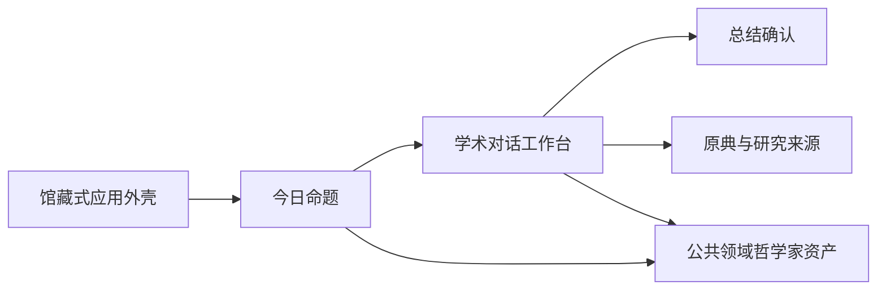

# Plan: PhilosophyOS 人文编辑式 UI 改版

| Field | Value |
|-------|-------|
| Status | complete |
| Created | 2026-07-27 |
| Ticket | N/A |
| Branch | TBD |

## Context

将 PhilosophyOS 从偏通用 SaaS 的界面升级为“现代人文期刊 + 学术知识工作台”。首轮以今日页和完整思考闭环为样板，保留现有 React 状态逻辑、API 契约和西方哲学 MVP 范围，同时提高阅读质感、来源可信度与移动端可用性。

## Architecture Decisions

- **参考组合：** 视觉编辑感参考 Aeon 与 The Public Domain Review，学术阅读结构参考 Manifold，知识关系参考 Quartz，讨论结构参考 PubPub；只借鉴交互和视觉原则，不复制 GPL 项目代码。
- **功能逻辑不重写：** 保留 Today、Dialogue、Reflection 的状态和组件边界，首轮主要调整标记层级、页面级样式和资产，降低行为回归风险。
- **页面命名空间优先：** 在全局设计 token 之上使用页面命名空间，避免修改通用 `h1`、按钮和卡片样式时误伤 Explore 与 Reflection。
- **真实学术资产：** 哲学家视觉只使用可识别的公共领域或兼容开放许可肖像、雕塑、手稿与原作；资产本地化并记录作者、来源、许可证与裁切焦点，不依赖运行时外链。
- **克制而非复古：** 使用纸白、炭黑、墨绿、文献蓝和少量酒红；减少胶囊标签、浮动卡片和重阴影，不使用羊皮纸纹理、装饰渐变或纯氛围图片。
- **阅读与操作分工：** 命题和对话正文使用稳定的中西文衬线字体栈，导航、元信息和控件使用无衬线字体；来源以脚注、页边注和文献目录语言呈现。
- **字体交付边界：** 首轮使用思源宋体、宋体与 Georgia 的系统字体栈；完整中文 Webfont 会产生数百个分片和不合理的首屏成本，待具备字符子集流水线后再本地打包。
- **可访问性门槛：** 目标 WCAG 2.2 AA，移动端交互目标不小于 44px，支持键盘、清晰焦点、200% 缩放与 `prefers-reduced-motion`。

## Diagrams

## Milestones Overview

1. **每日命题编辑样板** — 用户进入应用时首先感受到可信、清晰且具有阅读吸引力的哲学命题体验。
2. **完整思考工作台** — 用户从回答、查阅来源到确认总结的全过程保持统一的学术阅读语言，并通过桌面和移动端验收。

---

## Milestone 1: 每日命题编辑样板

**Why this matters:** 初次和重复使用的学习者都需要在几秒内理解今日命题、哲学背景和行动入口，而不是先识别一个通用后台界面。编辑式样板让哲学内容成为第一视觉信号，同时保留每日练习的效率。

**Success criteria:** 用户在桌面和移动端首屏都能看见具体哲学家、完整命题、核心张力和“开始思考”；更换题目不会引起布局跳动，图片失败时命题和操作仍完整可用。

**Key decisions:** 以 Aeon 的命题编辑层级为主、PDR 的公共领域图像处理为辅；不做营销首页，进入应用即是可使用的今日练习。

### Deliverable Spec

| Surface | Main content | Required states |
|---------|--------------|-----------------|
| 应用外壳 | 品牌、主导航、服务状态、账户 | 桌面侧栏、移动底栏、API 在线/离线 |
| 今日命题 | 哲学家、时代、命题、核心张力、来源 | 默认题、换题、图片失败、最近进度 |
| 视觉资产 | 本地公共领域图像与许可记录 | 桌面裁切、移动裁切、降级占位 |

### 1.1 [x] 建立人文编辑式设计基础 *(completed 2026-07-27)*
- **Files:** `apps/web/index.html`, `apps/web/src/main.tsx`, `apps/web/src/pages/TodayPage.tsx`, `apps/web/src/styles.css`, `apps/web/src/assets/philosophers/socrates-louvre.jpg`, `apps/web/src/assets/philosophers/kant-becker.jpg`, `apps/web/src/assets/philosophers/sartre-1967.jpg`, `apps/web/src/assets/ATTRIBUTION.md`
- **What:** 建立 paper、ink、forest、document-blue、burgundy、rule 等设计 token 和中西文字体角色；把外壳收敛为安静的馆藏索引式导航，弱化 API 状态；本地化首批哲学家公共领域资产并记录许可与裁切信息。不得改变 hash 路由和 API 健康检查行为。
- **Acceptance:** 外壳在 1440、1024、390、320 视口无横向溢出；在线/离线状态仍可辨认但不抢占主视觉；所有本地资产有来源和许可记录，加载失败时显示稳定占位；`pnpm build` 通过。
- **Dependencies:** None

### 1.2 [x] 重构今日命题页面 *(completed 2026-07-27)*
- **Files:** `apps/web/src/pages/TodayPage.tsx`, `apps/web/src/styles.css`
- **What:** 将当前左右卡片重构为非卡片式编辑版面，使用图像、命题、哲学家信息和细线元数据建立层级；减少胶囊标签和投影；日期改为动态中文日期；最近进度改为无卡片续读记录。保留换题和开始思考逻辑。
- **Acceptance:** 三道题切换时页面结构稳定；首屏包含哲学家、完整命题、核心张力和主操作，并露出下一段进度内容；图片失败不影响 CTA；键盘可完成换题和开始；1440、1024、390、320 截图达到学术感、层级、留白、控件一致性均不低于 4/5。
- **Dependencies:** 1.1

---

## Milestone 2: 完整思考工作台

**Why this matters:** 学习者需要把哲学对话当作逐步形成论证的研究过程，而不是普通聊天。统一的对话、来源和确认界面可以减少工具感，让注意力停留在理由、反例和概念边界上。

**Success criteria:** 用户可以从今日命题进入对话，切换模式、回答、查阅来源、结束并确认总结；全流程在桌面和移动端没有遮挡、来源混淆或视觉断层。

**Key decisions:** 消息采用研究笔记和页边批注语言，不使用沉重聊天气泡；模式控制保留分段控件；对话脉络保留现有四阶段数据；来源继续按原典和研究解释分层。

### Deliverable Spec

| Surface | Main action | Visual language |
|---------|-------------|-----------------|
| 对话工作台 | 选择模式、回答、结束 | 论证段落、作者边注、当前研究阶段 |
| 来源目录 | 查看原典和研究解释 | 脚注编号、版本位置、文献摘要 |
| 总结确认 | 编辑、勾选、保存 | 用户观点与 AI 建议保持明确来源边界 |
| 响应式验收 | 完成端到端思考 | 无遮挡、无横向溢出、键盘可完成 |

### 2.1 [x] 重构学术对话工作台 *(completed 2026-07-27)*
- **Files:** `apps/web/src/pages/DialoguePage.tsx`, `apps/web/src/components/DialogueOutline.tsx`, `apps/web/src/styles.css`
- **What:** 合并冗余顶部横条，允许问题标题完整阅读；把消息从聊天气泡改为带作者、来源和规则线的论证段落；将对话脉络改为页边目录式研究阶段，并保留五种模式、发送防重复、输入聚焦和结束流程。
- **Acceptance:** 五种模式均可切换且状态清晰；发送后用户和 AI 内容来源明确；桌面正文行宽适合长读，移动端输入框不遮挡底部导航；问题标题不被省略；现有总结入口仍可到达；`pnpm build` 通过。
- **Dependencies:** 1.1, 1.2

### 2.2 [x] 统一来源与总结确认的学术语言 *(completed 2026-07-27)*
- **Files:** `apps/web/src/components/SourceDrawer.tsx`, `apps/web/src/components/ReflectionReview.tsx`, `apps/web/src/styles.css`
- **What:** 将来源抽屉改为文献目录和页边注式排版，保留原典/研究解释层级；让总结页沿用相同字体、规则线、来源标识和操作语言。补齐抽屉打开后的焦点进入、焦点约束、Escape 关闭和焦点恢复。
- **Acceptance:** 来源条目显示作者、版本位置、摘要和外链；抽屉可完全用键盘操作且关闭后焦点返回触发按钮；总结默认不可保存，AI 建议编辑后仍保持 AI 来源，最终只显示已选项目；390 和 320 视口操作区不遮挡内容。
- **Dependencies:** 2.1

### 2.3 [x] 建立视觉与功能回归门槛 *(completed 2026-07-27)*
- **Files:** `apps/web/package.json`, `apps/web/playwright.config.ts`, `apps/web/e2e/editorial-thinking-flow.spec.ts`, `apps/web/e2e/accessibility.spec.ts`, `output/playwright/`
- **What:** 为今日换题、开始思考、模式切换、发送回答、来源开关、结束、总结编辑勾选、保存和返回今日建立最小 Playwright 回归；覆盖 1440×1000、1024×768、390×844、320×700，检查横向溢出、固定元素遮挡、控制台错误、键盘流程和严重可访问性问题。
- **Acceptance:** `pnpm build` 和新增 E2E 全部通过；目标视口无横向溢出、文本截断或底部遮挡；控制台 error/warning 为 0；WCAG 严重/高等级问题为 0；关键页面保存桌面和移动端验收截图。
- **Dependencies:** 2.2
