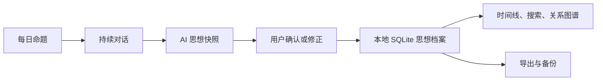

# Plan: PhilosophyOS 功能 Beta 快速完成

| Field | Value |
|-------|-------|
| Status | in-progress |
| Created | 2026-07-31 |
| Ticket | N/A |
| Branch | main |

## Context

PhilosophyOS 已经具备每日命题、AI 对话、思想快照、思想档案和关系图谱，但仍依赖手工配置与本地进程，且对话历史、数据管理和首次使用流程不完整。本计划优先交付一个不依赖 Obsidian、普通用户可以独立安装和使用的功能 Beta；好友、云同步、计费和高级协作留到商业化阶段。

## Architecture Decisions

- **本地优先且不依赖 Obsidian：** SQLite 成为对话、快照和用户设置的主存储；Obsidian 仅作为可选导出目标。
- **API Key 只由本机后端管理：** 前端可录入和测试，但后端永不回传明文，只返回掩码和配置状态。
- **先完成单人闭环：** 每日命题 -> 对话 -> AI 快照 -> 用户校正 -> 档案/图谱必须完整可恢复，社交功能暂缓。
- **减少死入口：** Beta 导航只展示已可用模块；未完成模块不占据主流程。
- **快照数据库位置：** SQLite 文件与旧 JSONL 放在同一目录并使用相同文件名主干，便于本地备份和迁移；JSONL 导入后保持只读备份。
- **可移植档案包：** JSON 备份使用版本化、无损结构并包含原始请求、AI 快照、用户修正与校对；导入必须先完整校验，再用单一事务合并。

## Diagrams

## Milestones Overview

1. **本地思想记忆闭环** - 没有 Obsidian 也能保存、恢复和修正长期思考。
2. **普通用户模型配置** - 用户直接在页面配置免费模型、GPT 或 DeepSeek。
3. **思想档案与哲学家图鉴** - 用户能查找、整理、导出自己的思想，并通过哲学家图鉴探索思想传统。
4. **可交付的本地 Beta** - 一键启动、核心流程自动测试、移除无效入口。

---

## Milestone 1: 本地思想记忆闭环

**Why this matters:** 单人用户无需安装 Obsidian，也能关闭应用后继续之前的对话，并看到思想随时间发生的真实变化。

**Success criteria:** 用户完成一次对话并生成快照，重启电脑后仍能恢复会话、查看快照、修改 AI 总结，且现有 JSONL 演示数据不会丢失。

**Key decisions:** SQLite 作为本地事实源；保留 JSONL 一次性迁移兼容；所有 AI 总结都必须允许用户确认、修正或拒绝。

### Deliverable Spec

| 能力 | 行为 | 数据位置 |
|------|------|----------|
| 会话保存 | 自动保存每轮用户与 AI 消息 | SQLite |
| 会话恢复 | 按最近时间继续或新建对话 | SQLite |
| 思想快照 | 保存生成状态、内容、用户决定和复核 | SQLite |
| 旧数据迁移 | 首次启动导入现有 JSONL，重复启动不重复导入 | SQLite migration |

### 1.1 [x] 建立 SQLite 存储与 JSONL 迁移 *(completed 2026-07-31)*
- **Files:** `apps/api/app/models/reflection.py`, `apps/api/app/storage/database.py`, `apps/api/app/storage/reflection_repository.py`, `apps/api/app/services/reflection_snapshots.py`, `apps/api/migrations/`, `apps/api/tests/`
- **What:** 建立本地 SQLite 数据库和仓储边界，将现有思想快照迁移到结构化表；首次启动安全导入 JSONL，并保留原文件作为备份。
- **Acceptance:** 旧演示快照全部可见；连续启动两次数据不重复；创建、更新和读取快照测试通过。
- **Dependencies:** None

### 1.2 [x] 持久化对话会话并支持继续思考 *(completed 2026-07-31)*
- **Files:** `apps/api/app/routes/dialogue.py`, `apps/api/app/schemas/dialogue.py`, `apps/api/app/services/`, `apps/web/src/pages/DialoguePage.tsx`
- **What:** 为对话增加会话 ID、消息历史、列表和恢复接口；页面提供最近会话与新建会话入口，并在刷新后恢复当前内容。
- **Acceptance:** 完成三轮对话后刷新页面，消息顺序、模型、模式和轮次保持一致；用户可明确新建会话。
- **Dependencies:** 1.1

### 1.3 [x] 完成快照失败重试与用户修正闭环 *(completed 2026-07-31)*
- **Files:** `apps/api/app/routes/reflection_snapshots.py`, `apps/api/app/services/reflection_snapshots.py`, `apps/web/src/components/ReflectionReview.tsx`, `apps/web/src/pages/ThoughtArchivePage.tsx`
- **What:** 对待生成或失败快照提供重新生成；用户可编辑关键立场、张力和下一问题，所有修改保留来源与时间。
- **Acceptance:** 模型失败时原话仍保存；恢复连接后可单独重试；修正后的内容立即反映到档案和关系图谱。
- **Dependencies:** 1.1, 1.2

---

## Milestone 2: 普通用户模型配置

**Why this matters:** 非开发者不应编辑 `.env` 或打开终端，才能选择免费模型、GPT 或 DeepSeek。

**Success criteria:** 新用户从页面完成模型配置和连接测试，API Key 不出现在前端存储、日志或任何读取响应中。

**Key decisions:** 后端写入本机私有配置；读取接口只返回是否配置和掩码；模型选项保持“免费 / GPT / DeepSeek”三类。

### Deliverable Spec

| 页面操作 | 后端行为 | 用户反馈 |
|----------|----------|----------|
| 选择模型类别 | 保存默认 profile | 当前模型立即更新 |
| 输入 Base URL、模型和 Key | 本机后端持久化 | 明文不回传 |
| 测试连接 | 发起最小请求 | 显示成功、延迟或可行动错误 |

### 2.1 [x] 增加安全的本地模型设置接口 *(completed 2026-07-31)*
- **Files:** `apps/api/app/routes/model_profiles.py`, `apps/api/app/settings.py`, `apps/api/app/services/`, `apps/api/tests/`
- **What:** 增加读取配置状态与更新本地配置的 API；敏感字段只写不读，日志必须脱敏，并对 Base URL、模型名和 API 风格做校验。
- **Acceptance:** 三类 profile 均可保存和重启恢复；任何 GET 响应均不包含完整 Key；错误地址返回明确错误。
- **Dependencies:** 1.1

### 2.2 [x] 完成首次使用与模型设置页面 *(completed 2026-07-31)*
- **Files:** `apps/web/src/main.tsx`, `apps/web/src/components/`, `apps/web/src/styles.css`
- **What:** 将现有模型切换器扩展为设置面板；未配置时引导录入，已配置时只显示掩码、模型和连接状态。
- **Acceptance:** 用户不接触终端即可完成配置、测试和切换；手机与桌面均无溢出；页面不保存明文 Key。
- **Dependencies:** 2.1

---

## Milestone 3: 可管理的思想档案

**Why this matters:** 思想档案必须帮助用户重新找到、比较和掌控自己的思考，而不仅是展示图谱。

**Success criteria:** 用户能在 30 秒内找到某一主题的历史观点，查看变化依据，并完成导出、备份或删除。

**Key decisions:** 搜索与筛选优先于继续增加图谱特效；图谱作为探索入口，时间线作为可信记录；删除必须明确确认。

### Deliverable Spec

| 功能 | 范围 |
|------|------|
| 搜索 | 标题、主题、立场、张力、哲学家、标签 |
| 筛选 | 日期、模型、确认状态、主题 |
| 导出 | JSON 与 Markdown |
| 数据控制 | 本地备份、导入、单条删除、全部清除 |
| 哲学家图鉴 | 跨时代与传统的人物检索、筛选、思想关系和档案入口 |

### 3.1 [x] 增加档案搜索、筛选和变化对比 *(completed 2026-07-31)*
- **Files:** `apps/api/app/routes/reflection_snapshots.py`, `apps/web/src/pages/ThoughtArchivePage.tsx`, `apps/web/src/styles.css`
- **What:** 增加组合搜索和筛选；从时间线或图谱进入同一详情；对发生变化的立场显示前后内容与证据来源。
- **Acceptance:** 演示数据可按主题、哲学家和日期筛选；图谱节点能定位对应档案；筛选为空时有清晰恢复操作。
- **Dependencies:** 1.3

### 3.2 [x] 增加导出、备份、导入与删除 *(completed 2026-07-31)*
- **Files:** `apps/api/app/routes/`, `apps/api/app/services/`, `apps/web/src/pages/ThoughtArchivePage.tsx`, `apps/api/tests/`
- **What:** 提供本地数据导出、备份、导入和删除接口及页面操作；导入前验证格式，破坏性操作要求二次确认。
- **Acceptance:** 导出后可在空数据库恢复；损坏文件不会覆盖现有数据；删除后列表和图谱同步更新。
- **Dependencies:** 1.1, 3.1

### 3.3 [ ] 建立可扩充的哲学家图鉴
- **Files:** `apps/web/src/data/philosophers.ts`, `apps/web/src/pages/PhilosopherAtlasPage.tsx`, `apps/web/src/main.tsx`, `apps/web/src/styles.css`, `apps/web/public/philosophers/`, `apps/web/src/pages/ThoughtArchivePage.tsx`
- **What:** 首批收录不少于 60 位有广泛影响力的哲学家，覆盖古希腊与古罗马、中世纪、近代、德国古典、现象学、存在主义、分析哲学、政治哲学及中国、印度等主要传统；提供姓名检索、时代/地区/流派筛选、核心思想、代表著作、人物关系和可靠来源字段。图鉴人物可进入相关每日命题与思想档案，数据与肖像资源采用可持续扩充的独立结构。
- **Acceptance:** 用户能按姓名、时代、地区和流派找到人物；每位人物至少具有中英文名、年代、传统、核心思想、代表著作和来源；无肖像时有一致的博物馆式占位展示；图鉴与思想档案中的哲学家筛选双向联通；桌面与 390px 手机视口无溢出。
- **Dependencies:** 3.1

---

## Milestone 4: 可交付的本地 Beta

**Why this matters:** 用户需要稳定打开产品并完成核心流程，而不是理解前后端端口和终端窗口。

**Success criteria:** 在一台新 Windows 电脑上按说明启动后，用户可从每日命题走到思想档案；重启服务后数据仍在；核心失败场景有明确恢复方式。

**Key decisions:** Beta 只展示可用模块；好友、云同步、计费、公开社区和高级 Obsidian 双向同步不进入本阶段。

### Before/After

当前用户需要维护两个终端，且导航包含尚未完成入口。完成后通过一个启动入口运行，状态可诊断，导航只包含完整可用的核心模块。

### 4.1 [ ] 统一启动、端口和健康恢复
- **Files:** `scripts/start-dev.ps1`, `scripts/start-dev.cmd`, `scripts/run-api-dev.ps1`, `scripts/run-web-dev.ps1`, `apps/web/src/main.tsx`, `docs/operations/`
- **What:** 提供单入口后台启动、重复启动检测、端口冲突提示、健康检查和停止脚本；默认端口契约固定为 API 8001、Web 5174。
- **Acceptance:** 连续启动两次不会产生冲突进程；电脑重启后可用一个命令恢复；前端能区分后端未启动、模型未配置和网络错误。
- **Dependencies:** 2.2

### 4.2 [ ] 建立核心闭环端到端测试
- **Files:** `apps/api/tests/`, `apps/web/`, `output/playwright/`
- **What:** 覆盖每日命题、三轮对话、生成或重试快照、用户修正、档案搜索、图谱定位和数据导出；同时覆盖模型不可用和后端断连。
- **Acceptance:** API 测试、前端构建和核心 E2E 全部通过；桌面与 390px 手机视口无阻塞性问题。
- **Dependencies:** 1.3, 2.2, 3.2, 3.3, 4.1

### 4.3 [ ] 收紧 Beta 导航与发布说明
- **Files:** `apps/web/src/main.tsx`, `apps/web/src/styles.css`, `README.md`, `docs/product/mvp-scope.md`
- **What:** 主导航只保留已完成模块；未完成能力进入“后续计划”说明；补充安装、备份、隐私和故障恢复说明。
- **Acceptance:** 页面无死入口和占位功能；新用户按 README 可完成一次完整使用；明确说明数据位置和 API Key 边界。
- **Dependencies:** 4.2

---

## Deferred Commercial Backlog

- 账号、云同步、多设备冲突合并与端到端加密
- 托管模型额度、订阅、计费、限流和成本控制
- 好友关系、私密讨论房间、邀请、通知和举报
- 管理后台、运行监控、审计日志和用户支持工具
- Obsidian 双向同步、插件化导出与高级知识图谱分析
