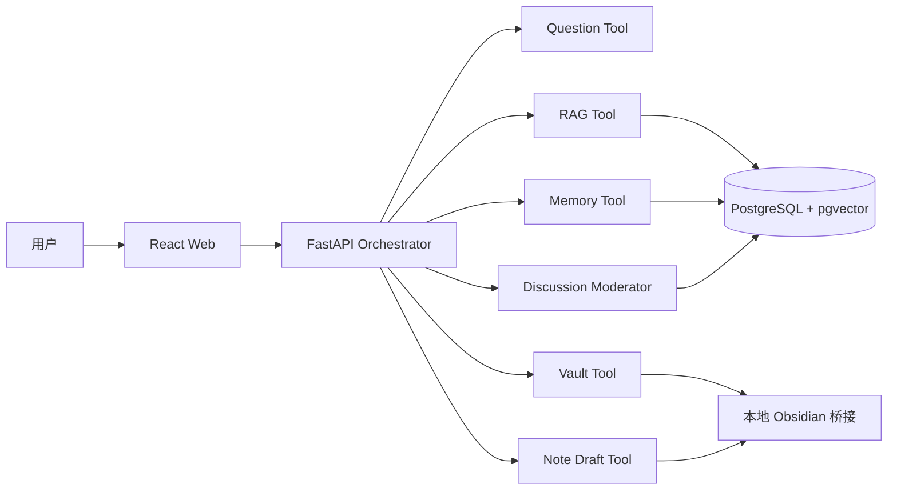

# Plan: PhilosophyOS MVP

| Field | Value |
|-------|-------|
| Status | in-progress |
| Created | 2026-07-26 |
| Ticket | N/A |
| Branch | TBD |

## Context

构建一个桌面优先的中文哲学学习应用：用户从审核题库或 Obsidian 开放问题开始每日思考，通过苏格拉底式对话和可信 RAG 澄清观点，最后将经确认的总结写回 Obsidian。单人闭环稳定后，用户可以添加好友并围绕具体问题进行私密讨论。MVP 仅覆盖西方哲学；中国哲学作为独立的 Phase 4 内容域后续加入。

## Architecture Decisions

- **西方哲学先行：** 从古希腊至当代保证 L1 时间线覆盖，优先深化九位 L3 人物，控制内容质量风险。
- **单编排器架构：** 使用一个 Orchestrator 和受控工具，避免首版多 Agent 的上下文冲突和成本。
- **关系库优先：** PostgreSQL + pgvector 支撑结构化实体和向量检索；Neo4j 延后到复杂图查询被证明必要时。
- **前后端分离：** React/TypeScript Web 界面 + FastAPI/Python API，便于实现 RAG 与本地文件桥接。
- **本地优先 Obsidian：** 默认只读索引，草稿经确认后写入；真实仓库接入前必须通过合成仓库安全测试。
- **证据约束生成：** 直接引语只能来自检索片段，页码必须绑定具体版本。
- **来源版本双重约束：** Source 保存书目版本，SourceChunk 保存不可变的版本快照；Schema 与数据库共同阻止无具体版本的直接引语进入 published 状态。
- **稳定种子标识：** 人工可读的哲学家 slug 通过固定命名空间映射为 UUIDv5，保证跨环境和重复导入的实体标识一致。
- **结构化混合检索：** 默认先按人物、传统、来源等级和发布状态过滤，再以 0.65 向量权重与 0.35 关键词权重排序；直接引语另经独立策略门审核。
- **知识问答契约：** 使用版本化 REST 资源返回 supported、corrected 或 insufficient 状态；引用上下文独立展开，检索命中不自动获得直接引语许可。
- **后期中国哲学：** 数据保留 `tradition`，但中国哲学使用独立分期、经典和关系词，不强制映射到西方分类。
- **私密问题型社交：** 好友功能只服务具体哲学讨论，不建设公开动态流；个人档案和 Obsidian 默认不共享。
- **服务端权限：** 好友、房间、消息和总结都在 API 层检查成员权限，不能依赖前端隐藏。

## Diagrams

## Milestones Overview

1. **可信内容底座** — 用户能够查询首批西方哲学内容，并看到真实来源。
2. **每日思辨闭环** — 用户能够完成每日问题、追问和总结。
3. **Obsidian 安全沉淀** — 用户能够从旧笔记获得问题，并确认写回新思考。
4. **个人思想档案** — 用户能够回顾、纠正和比较自己的历史观点。
5. **好友哲学讨论** — 用户能够邀请好友围绕具体问题进行私密、可控的讨论。
6. **质量加固与测试发布** — 核心风险通过自动和人工评测，完成可试用版本。

---

## Milestone 1: 可信内容底座

**Why this matters:** 哲学学习者首先需要相信人物、概念和引语没有被模型编造；可靠内容也是后续对话和推荐的共同基础。

**Success criteria:** 用户可以查询康德、斯宾诺莎和尼采的首批资料，所有知识性断言都有可展开来源，证据不足时系统明确降级。

**Key decisions:** 先用三位重点人物完成小型 RAG；比较纯向量、混合检索和结构化过滤后再扩大内容范围。

### Deliverable Spec

| Deliverable | Input | Output | Constraint |
| --- | --- | --- | --- |
| 内容导入 | 审核 Source/SourceChunk | 可检索片段 | 保留版本、版权和哈希 |
| 人物查询 | 人物/概念问题 | 带来源回答 | 无证据不确定性回答 |
| 引用展开 | citation id | 原文上下文 | 直接引语逐字匹配 |
| RAG 评测 | 固定评测集 | 方案对比报告 | blocker 100% 通过 |

### 1.1 [x] 建立工程骨架与架构决策 *(completed 2026-07-26)*
- **Files:** `.gitignore`, `docs/adr/001-application-stack.md`, `apps/api/pyproject.toml`, `apps/api/app/__init__.py`, `apps/api/app/main.py`, `apps/api/tests/test_health.py`, `apps/web/package.json`, `apps/web/pnpm-lock.yaml`, `apps/web/pnpm-workspace.yaml`, `apps/web/index.html`, `apps/web/tsconfig.json`, `apps/web/vite.config.ts`, `apps/web/src/main.tsx`, `apps/web/src/styles.css`, `apps/web/src/vite-env.d.ts`
- **What:** 建立 FastAPI 与 React/TypeScript 最小项目，记录运行方式、端口、配置和本地开发边界，不接入真实用户数据。
- **Acceptance:** API 健康检查与 Web 空壳可本地启动；ADR 解释技术选择和备选方案。
- **Dependencies:** None

### 1.2 [x] 定义公共知识与来源模型 *(completed 2026-07-26)*
- **Files:** `apps/api/pyproject.toml`, `apps/api/alembic.ini`, `apps/api/app/models/__init__.py`, `apps/api/app/models/knowledge.py`, `apps/api/app/schemas/__init__.py`, `apps/api/app/schemas/knowledge.py`, `apps/api/migrations/env.py`, `apps/api/migrations/script.py.mako`, `apps/api/migrations/versions/*_knowledge_schema.py`, `apps/api/tests/models/test_knowledge.py`
- **What:** 实现 PhilosophyEntity、Relation、Source 和 SourceChunk，包含 tradition、等级、版权状态、版本和证据字段。
- **Acceptance:** 迁移可重复执行；直接引语缺少具体来源版本时无法进入 published 状态。
- **Dependencies:** 1.1

### 1.3 [x] 导入哲学家种子数据 *(completed 2026-07-26)*
- **Files:** `apps/api/app/importers/__init__.py`, `apps/api/app/importers/philosophers.py`, `data/seed/philosophers.csv`, `apps/api/tests/importers/test_philosophers.py`
- **What:** 校验并导入种子人物；拒绝未知 tradition、非法等级和重复 id；输出导入报告。
- **Acceptance:** 当前 CSV 全部成功导入；重复运行不产生重复数据；错误行包含明确诊断。
- **Dependencies:** 1.2

### 1.4 [x] 实现三种检索方案实验 *(completed 2026-07-26)*
- **Files:** `apps/api/app/rag/__init__.py`, `apps/api/app/rag/retrievers.py`, `apps/api/app/rag/citations.py`, `apps/api/tests/rag/test_retrievers.py`, `reports/rag-spike.md`
- **What:** 完成纯向量、混合检索、结构化过滤三种方案，并按技术验证文档记录准确性、延迟和失败案例。
- **Acceptance:** 引用相关 blocker 案例全部通过；报告给出明确推荐方案。
- **Dependencies:** 1.2

### 1.5 [x] 提供带引用的知识问答接口 *(completed 2026-07-26)*
- **Files:** `apps/api/app/main.py`, `apps/api/app/routes/__init__.py`, `apps/api/app/routes/knowledge.py`, `apps/api/app/services/__init__.py`, `apps/api/app/services/answer.py`, `apps/api/tests/routes/__init__.py`, `apps/api/tests/routes/test_knowledge.py`, `apps/web/src/main.tsx`, `apps/web/src/styles.css`, `apps/web/src/pages/ExplorePage.tsx`, `apps/web/src/components/CitationPanel.tsx`
- **What:** 提供人物/概念问答和引用上下文，界面区分原典、研究解释和 AI 推论。
- **Acceptance:** 三位重点人物的测试问题可返回来源；错误著作归属被纠正；无证据时不生成引语。
- **Dependencies:** 1.4

---

## Milestone 2: 每日思辨闭环

**Why this matters:** 用户需要的不只是查询资料，而是一条每天可以完成、能够推进自身思考的学习路径。

**Success criteria:** 用户可以选择今日问题、完成 2–5 轮相关追问、主动结束并确认观点总结。

**Key decisions:** 审核问题库负责主题和冲突，模型只个性化措辞与追问；每轮只提出一个核心问题。

### Deliverable Spec

| Screen/API | Main action | Required states |
| --- | --- | --- |
| 今日页 | 开始或更换问题 | 冷启动、来源题、失败回退、已完成 |
| 对话页 | 回答、提示、解释、结束 | 流式响应、工具失败、模式切换 |
| 总结页 | 确认或修改观点 | 主体不明、待确认、已保存 |

### 2.1 [ ] 导入并筛选每日问题库
- **Files:** `apps/api/app/models/questions.py`, `apps/api/app/importers/questions.py`, `apps/api/app/services/question_selector.py`, `apps/api/tests/questions/test_selector.py`
- **What:** 导入 60 道种子题，按领域、难度、历史重复和用户跳过记录筛选。
- **Acceptance:** 30 天内不重复同题；冷启动无需用户记忆；失败时回退审核题库。
- **Dependencies:** 1.3

### 2.2 [ ] 实现 Orchestrator 与对话模式
- **Files:** `apps/api/app/agent/orchestrator.py`, `apps/api/app/agent/policies.py`, `apps/api/app/schemas/dialogue.py`, `apps/api/tests/agent/test_modes.py`
- **What:** 实现 Socratic、Explain、Compare、Reflect 和 Organize 模式及显式切换规则。
- **Acceptance:** 用户要求直接解释时停止追问；苏格拉底模式每轮只有一个主要问题。
- **Dependencies:** 1.5, 2.1

### 2.3 [ ] 实现观点主体识别
- **Files:** `apps/api/app/models/memory.py`, `apps/api/app/agent/attribution.py`, `apps/api/tests/agent/test_attribution.py`
- **What:** 标注 user、third_party、author、assistant 和 unknown，并保存原始证据消息。
- **Acceptance:** 第三方转述不会进入用户立场；用户纠正后移除错误归属。
- **Dependencies:** 2.2

### 2.4 [ ] 实现今日与对话页面
- **Files:** `apps/web/src/pages/TodayPage.tsx`, `apps/web/src/pages/DialoguePage.tsx`, `apps/web/src/components/DialogueOutline.tsx`, `apps/web/src/components/SourceDrawer.tsx`
- **What:** 按低保真原型实现今日卡片、对话脉络、来源抽屉和模式操作。
- **Acceptance:** 桌面与移动视口无内容重叠；用户三次点击内开始回答；来源默认不打断初步思考。
- **Dependencies:** 2.2

### 2.5 [ ] 实现总结确认闭环
- **Files:** `apps/api/app/agent/reflection.py`, `apps/web/src/components/ReflectionReview.tsx`, `apps/api/tests/agent/test_reflection.py`
- **What:** 生成当前观点、理由、概念校正、开放问题和关联建议，并允许逐项修改确认。
- **Acceptance:** AI 建议与用户观点视觉和数据上分离；未确认内容不进入长期记忆。
- **Dependencies:** 2.3, 2.4

---

## Milestone 3: Obsidian 安全沉淀

**Why this matters:** 已有 Obsidian 用户可以继续使用自己的知识仓库，而不是被迫迁移到新的封闭笔记系统。

**Success criteria:** 系统能从合成仓库提取开放问题，生成符合现有格式的草稿，经确认写入并完整撤销。

**Key decisions:** 先比较直接目录与 Local REST API；默认只读；真实仓库只在合成测试通过后接入。

### Deliverable Spec

| Operation | Default | Safety gate |
| --- | --- | --- |
| 索引 | 只读 `.md` | 排除 `.obsidian` 和用户路径 |
| 创建 | 草稿 | 用户确认目标文件 |
| 更新 | 差异预览 | 内容哈希未变化 |
| 撤销 | 最近一次 AI 写入 | 审计记录完整 |

### 3.1 [ ] 建立合成 Obsidian 测试仓库与解析器
- **Files:** `tests/fixtures/obsidian-vault/`, `apps/api/app/vault/parser.py`, `apps/api/tests/vault/test_parser.py`
- **What:** 创建包含 YAML、标签、链接、提示块和任务的合成仓库，并实现只读解析。
- **Acceptance:** 开放问题提取准确率达到 95%；插件数据读取次数为 0。
- **Dependencies:** 1.1

### 3.2 [ ] 对比目录与 Local REST API 接入
- **Files:** `apps/api/app/vault/filesystem.py`, `apps/api/app/vault/local_rest.py`, `reports/obsidian-spike.md`, `apps/api/tests/vault/test_adapters.py`
- **What:** 实现两个最小适配器并比较权限、冲突检测、安装成本和 Windows 稳定性。
- **Acceptance:** 报告选择 MVP 默认方案；认证信息不进入日志或模型上下文。
- **Dependencies:** 3.1

### 3.3 [ ] 实现 Markdown 草稿与结构化差异
- **Files:** `apps/api/app/vault/drafts.py`, `apps/api/app/vault/templates.py`, `apps/api/tests/vault/test_drafts.py`
- **What:** 按现有 YAML 和章节模板生成新笔记或段落补丁，保留用户措辞和双向链接。
- **Acceptance:** 生成结果通过 Markdown 快照测试；AI 推论不会进入“我的暂定立场”。
- **Dependencies:** 2.5, 3.1

### 3.4 [ ] 实现确认写入、冲突检测和撤销
- **Files:** `apps/api/app/vault/writer.py`, `apps/api/app/models/audit.py`, `apps/api/tests/vault/test_writer.py`
- **What:** 写入前重新校验哈希，使用安全替换和审计记录，支持撤销最近一次 AI 写入。
- **Acceptance:** 未确认写入为 0；哈希冲突全部阻断；撤销后文件哈希与写入前一致。
- **Dependencies:** 3.2, 3.3

### 3.5 [ ] 实现笔记工作台
- **Files:** `apps/web/src/pages/NotebookWorkbenchPage.tsx`, `apps/web/src/components/MarkdownDiff.tsx`, `apps/web/src/components/WriteConfirmation.tsx`
- **What:** 展示目标、原文、差异、最终草稿和写入状态；提供取消、保存草稿、确认和撤销。
- **Acceptance:** 用户写入前始终看到目标文件和具体差异；冲突状态禁止确认按钮。
- **Dependencies:** 3.4

---

## Milestone 4: 个人思想档案

**Why this matters:** 用户能够看见自己长期思考的变化，而不是只积累彼此孤立的聊天记录。

**Success criteria:** 用户可以按主题查看已确认观点，比较两个时间点，并决定是否接受系统识别出的变化。

**Key decisions:** 保存具体、有时间和来源的观点，不生成固定人格或意识形态标签。

### Deliverable Spec

| View | Data | User control |
| --- | --- | --- |
| 主题档案 | 已确认观点、理由、开放问题 | 编辑、撤回、删除 |
| 时间对比 | 两段原文和差异候选 | 确认、修改、拒绝 |
| 记忆设置 | 兴趣、进度、观点 | 导出、关闭、删除 |

### 4.1 [ ] 实现观点卡片与开放问题状态
- **Files:** `apps/api/app/services/memory.py`, `apps/api/app/routes/memory.py`, `apps/api/tests/memory/test_viewpoints.py`
- **What:** 提供观点确认、修订、撤回、删除和开放问题复访状态。
- **Acceptance:** 删除后不再用于推荐；每张卡片可追溯到原对话。
- **Dependencies:** 2.5

### 4.2 [ ] 实现观点变化候选
- **Files:** `apps/api/app/agent/growth.py`, `apps/api/tests/agent/test_growth.py`
- **What:** 比较同主题历史观点，生成带原文证据和审慎措辞的变化候选。
- **Acceptance:** 系统不会自动确认变化；拒绝结果不会反复提示同一候选。
- **Dependencies:** 4.1

### 4.3 [ ] 实现思想档案与隐私控制页面
- **Files:** `apps/web/src/pages/ThoughtArchivePage.tsx`, `apps/web/src/pages/MemorySettingsPage.tsx`, `apps/web/src/components/ViewpointTimeline.tsx`
- **What:** 实现主题/时间视图、观点对比、编辑删除、记忆关闭和导出入口。
- **Acceptance:** 用户可完整控制长期记忆；页面不显示未经确认的人格结论。
- **Dependencies:** 4.2

---

## Milestone 5: 好友哲学讨论

**Why this matters:** 用户可以把个人思考带入真实关系，通过与朋友比较理由和概念边界获得单人对话无法提供的思想碰撞。

**Success criteria:** 用户能够安全添加好友、邀请 2–8 人进入私密房间、围绕具体问题讨论，并分别确认自己的个人总结。

**Key decisions:** 不建设公开动态或粉丝系统；分享按条目明确授权；AI 只主持和总结，不裁决输赢；好友讨论不阻塞最初的单人 MVP 发布。

### Deliverable Spec

| Capability | Action | Privacy/Safety gate |
| --- | --- | --- |
| 好友关系 | 请求、接受、拒绝、删除、拉黑 | 只有接收方能接受关系 |
| 讨论邀请 | 分享问题或明确选择的观点快照 | 接收方接受后才能读取房间 |
| 私密房间 | 2–8 人消息和来源 | 每次请求服务端校验成员权限 |
| AI 主持 | 澄清概念、总结共同点和分歧 | 不评分、不替用户发言 |
| 个人沉淀 | 独立个人总结 | 只提取本人观点并单独确认 |
| 社交安全 | 退出、拉黑、举报、速率限制 | 房间内始终可访问 |

### 5.1 [ ] 实现账号标识与好友关系
- **Files:** `apps/api/app/models/social.py`, `apps/api/app/routes/friends.py`, `apps/api/app/services/friends.py`, `apps/api/tests/social/test_friends.py`
- **What:** 实现唯一用户名、好友请求、接受拒绝、删除和拉黑；不接入通讯录批量发现。
- **Acceptance:** 只有接收者可以接受请求；拉黑后双方不能发送新请求、邀请或直接消息。
- **Dependencies:** 1.1

### 5.2 [ ] 实现私密讨论房间和权限
- **Files:** `apps/api/app/routes/discussions.py`, `apps/api/app/services/discussions.py`, `apps/api/app/models/social.py`, `apps/api/tests/social/test_permissions.py`
- **What:** 实现 2–8 人私密房间、邀请接受、成员状态、消息和分享快照，所有读取写入执行服务端权限校验。
- **Acceptance:** 非成员无法读取房间元数据、消息、来源或总结；退出者不能读取退出后的新消息。
- **Dependencies:** 5.1

### 5.3 [ ] 实现多人讨论主持与独立总结
- **Files:** `apps/api/app/agent/discussion_moderator.py`, `apps/api/app/services/discussion_summary.py`, `apps/api/tests/agent/test_discussion_moderator.py`
- **What:** 按作者区分观点，生成共同点、分歧和开放问题；为每位参与者生成只包含本人观点的个人草稿。
- **Acceptance:** 多人观点归属正确率 100%；AI 不宣布胜负；共同总结不自动进入任何个人记忆。
- **Dependencies:** 2.3, 5.2

### 5.4 [ ] 实现好友、邀请和讨论页面
- **Files:** `apps/web/src/pages/FriendsPage.tsx`, `apps/web/src/pages/DiscussionRoomPage.tsx`, `apps/web/src/components/SharePreview.tsx`, `apps/web/src/components/DiscussionSummary.tsx`
- **What:** 实现好友列表、请求、讨论邀请、分享预览、私密房间、共同总结和个人总结确认。
- **Acceptance:** 分享前显示具体接收人和内容范围；拉黑、举报和退出在房间内始终可见。
- **Dependencies:** 5.2, 5.3

### 5.5 [ ] 实现社交通知、安全限制和权限回归
- **Files:** `apps/api/app/services/notifications.py`, `apps/api/app/services/moderation.py`, `apps/api/tests/social/test_moderation.py`, `apps/web/e2e/friend-discussion.spec.ts`
- **What:** 实现好友请求、讨论邀请和新消息通知，以及举报、速率限制和完整端到端权限测试。
- **Acceptance:** 社交相关 blocker 案例全部通过；骚扰场景可立即退出、拉黑和举报；通知不泄露私密消息正文。
- **Dependencies:** 5.4

---

## Milestone 6: 质量加固与测试发布

**Why this matters:** 测试用户只有在引用可信、私人笔记安全且失败可恢复时，才会愿意把真实思想资料交给产品。

**Success criteria:** 所有 blocker 评测通过，核心流程跨桌面和移动视口可用，测试用户能完成完整演示路径。

**Key decisions:** 阻断错误优先于功能数量；任何未确认写入或伪造引用都会阻止发布。

### Deliverable Spec

| Gate | Requirement |
| --- | --- |
| 自动评测 | blocker 100%，critical >= 95%，整体 >= 90% |
| 内容评测 | 哲学准确性 >= 1.7/2，追问质量 >= 1.6/2 |
| UI | 核心流程桌面/移动无阻断和重叠 |
| 数据安全 | 未确认写入 0，撤销测试 100% |

### 6.1 [ ] 建立自动评测运行器
- **Files:** `apps/api/app/evals/runner.py`, `apps/api/tests/evals/test_cases.py`, `data/evals/cases.csv`, `reports/evaluation-template.md`
- **What:** 读取固定案例，执行行为断言和分级报告，支持模型、提示词和知识快照版本记录。
- **Acceptance:** 45 个种子案例可重复运行；blocker 失败返回非零状态并阻止发布。
- **Dependencies:** 1.5, 2.5, 3.4, 4.2, 5.5

### 6.2 [ ] 完成端到端和失败恢复测试
- **Files:** `apps/web/e2e/daily-challenge.spec.ts`, `apps/web/e2e/obsidian-write.spec.ts`, `apps/web/e2e/failure-recovery.spec.ts`
- **What:** 覆盖演示路径、检索失败、文件冲突、写入失败和撤销。
- **Acceptance:** 桌面与移动测试全部通过；失败后用户输入和原文件均保留。
- **Dependencies:** 6.1

### 6.3 [ ] 完成内容与隐私发布审核
- **Files:** `reports/content-review.md`, `reports/privacy-review.md`, `docs/release-checklist.md`
- **What:** 按来源、引用、权限、日志和删除能力完成发布前审核。
- **Acceptance:** 无未处理 blocker；所有受限来源按版权策略标注；隐私删除路径验证通过。
- **Dependencies:** 6.1

### 6.4 [ ] 发布本地测试版
- **Files:** `README.md`, `docs/getting-started/local-install.md`, `CHANGELOG.md`
- **What:** 提供本地安装、测试仓库连接、模型配置、已知限制和卸载/数据删除说明。
- **Acceptance:** 新环境按文档可在 15 分钟内启动，并完成 MVP 演示路径。
- **Dependencies:** 6.2, 6.3
