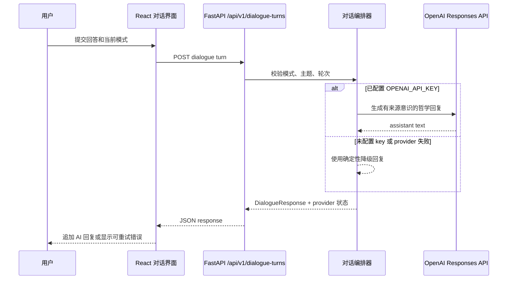

# Plan: 真实 AI 对话接入

| Field | Value |
|-------|-------|
| Status | in-progress |
| Created | 2026-07-27 |
| Ticket | N/A |
| Branch | TBD |

## Context

PhilosophyOS 现在已经有较完整的对话 UI 和一个确定性的后端对话编排器，但网页中的 AI 回复仍然由 `DialoguePage.tsx` 在前端本地拼接。这个计划会先把对话统一接入 FastAPI，再把确定性回复边界替换为 OpenAI provider，同时保留项目已有约束：首期只做西方哲学、回答要有来源意识、模型密钥不能进入浏览器、证据不足时必须明确降级。

## Architecture Decisions

- **只通过后端代理模型调用：** 浏览器只访问本地 FastAPI，不直接访问 OpenAI。`OPENAI_API_KEY` 只存在后端环境变量中，符合 ADR-001 的隐私边界。
- **使用 Responses API 作为模型边界：** 后续接入 OpenAI 时优先走 Responses API，不再新增一套旧式 chat 抽象。模型保持可配置，默认先按当前官方方向使用 `gpt-5.6`。
- **确定性降级保留为一等路径：** 如果没有配置 key，后端仍返回现有 deterministic orchestrator 的回复，并在元数据里说明 provider 状态。这样本地演示、测试和开发不会被密钥阻断。
- **先做非流式，再考虑流式：** 第一版先交付 `/api/v1/dialogue-turns` 的普通 JSON 返回。等真实体验稳定后，再评估是否需要 token 级流式输出。
- **提示词和行为约束放在服务端：** 模式规则、主题、轮次、来源政策和“不编造引文”都由后端组装，前端保持视图层职责。

## Diagrams

## Milestones Overview

1. **后端对话契约** - 给前端和后续模型接入提供稳定的本地 API。
2. **前端改用 API 回复** - 对话页面停止使用前端假回复，改为调用后端。
3. **OpenAI Provider 边界** - 配置 key 后使用真实模型，没有 key 时保持确定性降级。
4. **回归测试与文档** - 把真实对话接入方式、降级策略和本地运行步骤固定下来。

---

## Milestone 1: 后端对话契约

**Why this matters:** 前端在接入真实模型前，需要先拥有一个稳定、可测试的本地对话接口。用户最终会受益于这个边界：后续模型、提示词和降级策略都可以在后端演进，而不破坏已经打磨好的对话界面。

**Success criteria:** 开发者可以向 API 提交一轮用户回答，并得到符合 `DialogueResponse` 的回复。OpenAPI 能看到新路由，测试证明五种模式能通过 HTTP 入口被调用。

**Key decisions:** 路由命名沿用现有 knowledge routes 的版本化复数资源风格，使用 `/api/v1/dialogue-turns`。第一步不引入持久化，也不直接接 OpenAI，只暴露现有 deterministic orchestrator。

### Deliverable Spec

| Endpoint | Method | Request | Response | Notes |
|----------|--------|---------|----------|-------|
| `/api/v1/dialogue-turns` | `POST` | `DialogueRequest` | `DialogueResponse` | 先返回 deterministic orchestrator 输出 |

### 1.1 [x] 暴露版本化对话轮次 API *(completed 2026-07-27)*
- **Files:** `apps/api/app/main.py`, `apps/api/app/routes/dialogue.py`, `apps/api/app/schemas/dialogue.py`, `apps/api/tests/routes/test_dialogue.py`
- **What:** 创建 dialogue route，接收现有 `DialogueRequest`，调用 `dialogue_orchestrator.respond`，返回 `DialogueResponse`。在 `main.py` 注册 router。保持严格校验，本任务不引入持久化。
- **Acceptance:** `pytest` 通过；route test 至少覆盖 Socratic、Explain、Organize 三种模式；OpenAPI 包含 `/api/v1/dialogue-turns`。
- **Dependencies:** None

---

## Milestone 2: 前端改用 API 回复

**Why this matters:** 用户仍然使用同一个学术对话界面，但 AI 回复来源从前端脚本变成后端契约。这样真实 AI 接入时，UI 不需要大拆。

**Success criteria:** 用户从 Today 进入 Dialogue 后，可以切换模式、提交回答、看到后端返回的 assistant 回复；API 失败时能看到克制的失败提示并重试；结束后仍能进入总结确认。

**Key decisions:** 暂时保持非流式交互和现有“正在整理”状态。请求失败时显示 inline retry，不默默塞入假回复。

### Deliverable Spec

| UI State | Behavior |
|----------|----------|
| Sending | 禁用发送，显示现有 thinking 状态 |
| Success | 追加 `/api/v1/dialogue-turns` 返回的 assistant response |
| Failure | 保留用户消息，显示可重试错误，不重复追加用户轮次 |
| Finish | `ReflectionReview` 只接收用户原创轮次 |

### 2.1 [x] 用对话 API 替换前端假回复 *(completed 2026-07-27)*
- **Files:** `apps/web/src/pages/DialoguePage.tsx`, `apps/web/src/main.tsx`, `apps/web/e2e/editorial-thinking-flow.spec.ts`
- **What:** 将 `apiBaseUrl` 传入 `DialoguePage`，提交时调用 `/api/v1/dialogue-turns`，正常路径移除前端 `responseFor` 假回复。保留模式切换、进度动画、输入框聚焦和总结行为。
- **Acceptance:** `pnpm build` 通过；`pnpm e2e` 使用 mocked `/api/v1/dialogue-turns` 通过；手动浏览器流程能确认 assistant response 来自 API。
- **Dependencies:** 1.1

### 2.2 [x] 增加 API 失败与重试行为 *(completed 2026-07-27)*
- **Files:** `apps/web/src/pages/DialoguePage.tsx`, `apps/web/src/styles.css`, `apps/web/e2e/editorial-thinking-flow.spec.ts`
- **What:** 当对话请求失败或返回非法 JSON 时，显示小型 inline 错误/重试操作。用户已经提交的消息保留，重试时不重复插入用户消息。
- **Acceptance:** E2E 覆盖一次失败后重试成功；控制台无 error/warning；390 和 320 宽度下输入区不遮挡底部导航。
- **Dependencies:** 2.1

---

## Milestone 3: OpenAI Provider 边界

**Why this matters:** 这一步让 PhilosophyOS 从脚本化演示变成真正的思考伙伴。用户会得到更贴合上下文和模式的回答，同时系统仍保留来源纪律和归属边界。

**Success criteria:** 设置 `OPENAI_API_KEY` 后，后端使用 OpenAI 生成 mode-aware assistant turn；没有 key 时，本地 demo 和自动测试继续使用确定性降级。前端永远不会接触或存储模型密钥。

**Key decisions:** 使用官方 Python SDK 和可配置 settings：`OPENAI_API_KEY`、`OPENAI_MODEL`、`PHILOSOPHYOS_AI_PROVIDER`。默认模型为 `gpt-5.6`。提示词由后端受测 builder 生成。

### Deliverable Spec

| Config key | Type | Default | Description |
|------------|------|---------|-------------|
| `OPENAI_API_KEY` | secret string | unset | 配置后启用 OpenAI-backed responses |
| `OPENAI_MODEL` | string | `gpt-5.6` | Responses API 使用的模型 |
| `PHILOSOPHYOS_AI_PROVIDER` | enum | `auto` | `auto`、`openai` 或 `deterministic` |

### 3.1 [x] 增加 provider settings 与 OpenAI client 边界 *(completed 2026-07-27)*
- **Files:** `apps/api/pyproject.toml`, `apps/api/app/agent/providers.py`, `apps/api/app/settings.py`, `apps/api/tests/agent/test_providers.py`, `.env.example`
- **What:** 增加 OpenAI SDK 依赖，创建类型化 settings，实现 deterministic 和 OpenAI 两个 provider。单元测试不真实访问网络，只 mock OpenAI client 边界。
- **Acceptance:** 未设置 `OPENAI_API_KEY` 时 `pytest` 通过；测试证明无 key 使用 deterministic fallback，mock OpenAI response 可映射为 assistant text。
- **Dependencies:** 1.1

### 3.2 [x] 构建并测试 PhilosophyOS 提示词契约 *(completed 2026-07-27)*
- **Files:** `apps/api/app/agent/prompting.py`, `apps/api/app/agent/orchestrator.py`, `apps/api/tests/agent/test_prompting.py`, `docs/agent/behavior-spec.md`
- **What:** 创建服务端 prompt builder，纳入 mode、topic、turn number、user message、source policy 和“不编造引文”规则。保证 Explain 和 Organize 的问题预算仍符合既有 policy tests。
- **Acceptance:** prompt tests 覆盖五种模式；prompt 包含来源与归属约束；现有 mode policy tests 继续通过。
- **Dependencies:** 3.1

### 3.3 [x] 通过选定 provider 路由对话轮次 *(completed 2026-07-27)*
- **Files:** `apps/api/app/agent/orchestrator.py`, `apps/api/app/routes/dialogue.py`, `apps/api/tests/routes/test_dialogue.py`, `apps/api/tests/agent/test_modes.py`
- **What:** 更新编排流程：配置 provider 成功时使用 OpenAI-backed 输出；无 key 或 provider 失败时使用 deterministic fallback，并通过 provider metadata 可见。保留模式切换和 evidence status 语义。
- **Acceptance:** route tests 覆盖 provider 成功、provider 失败降级、无 key 降级；`pytest` 通过；`pnpm e2e` 可继续使用 mocked API response。
- **Dependencies:** 3.1, 3.2

---

## Milestone 4: 回归测试与文档

**Why this matters:** 真实 AI 接入很容易静默坏掉：key 缺失、provider 失败、重试重复消息、提示词削弱来源纪律。测试和文档能给后续好友讨论功能一条更稳的跑道。

**Success criteria:** 开发者可以按 README 启动 deterministic mode 或 OpenAI mode；本地检查能捕获路由、UI、可访问性和 provider fallback 回归。

**Key decisions:** 默认测试不做真实 OpenAI 网络调用。provider 行为通过 mocked tests 覆盖，真实凭证只作为可选手动 smoke test。

### Before/After

当前项目已有脚本化 UI 流程的 e2e，但没有模型 provider setup docs，也没有后端 dialogue route checks。完成后，route、前端 API 接入、provider fallback 和本地配置路径都会被自动测试与文档覆盖。

### 4.1 [x] 扩展 API-backed dialogue 回归测试 *(completed 2026-07-27)*
- **Files:** `apps/web/e2e/editorial-thinking-flow.spec.ts`, `apps/web/e2e/accessibility.spec.ts`, `apps/api/tests/routes/test_dialogue.py`
- **What:** 浏览器测试 mock 新 dialogue endpoint 的成功和失败模式，断言无 console errors，并保留 1440/1024/390/320 布局门槛。
- **Acceptance:** `pnpm build`、`pnpm e2e`、`pytest` 全部通过。
- **Dependencies:** 2.2, 3.3

### 4.2 [ ] 记录本地 AI 配置与 smoke test
- **Files:** `README.md`, `.env.example`, `docs/agent/behavior-spec.md`
- **What:** 文档说明 deterministic mode、OpenAI mode、环境变量和一个手动 smoke test 命令。明确 API key 只放后端 `.env`，绝不通过 Vite 暴露。
- **Acceptance:** README 有可复制命令；`.env.example` 只包含非密钥占位；docs 说明 fallback 行为。
- **Dependencies:** 3.3
